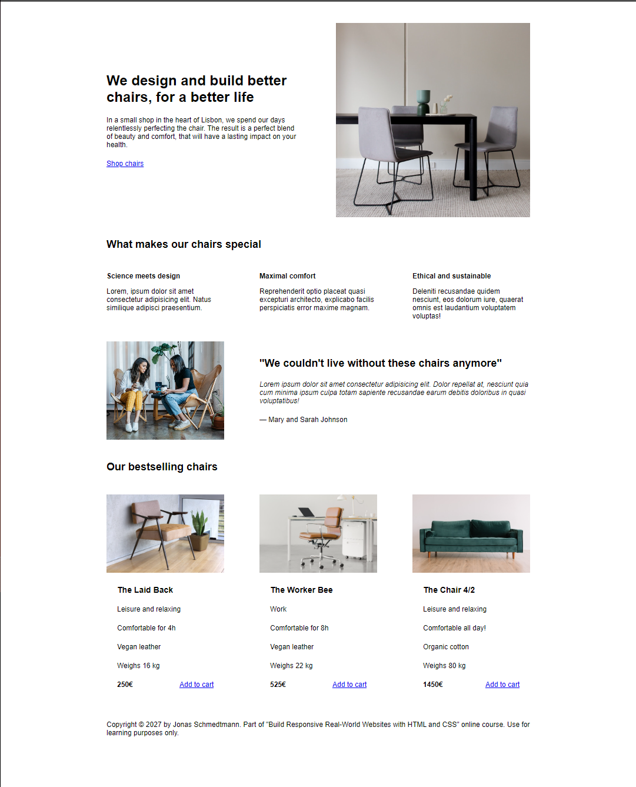
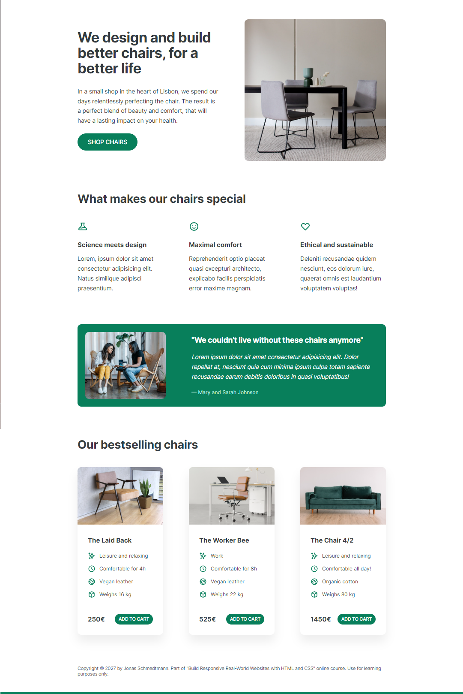

# Chair Company

A mule to add a design and UX rules and good practices, regarding:

- Typography
- Colors
- Images and Illustrations
- Icons
- Shadows
- Border-Radius
- Whitespace
- Visual Hierarchy
- User Experience
- Components and Layout

# Before

# After
 